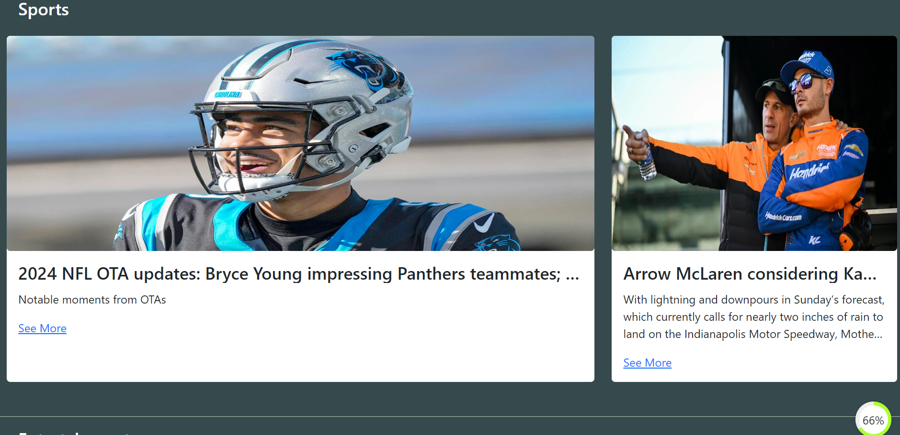

<h5>Title</h5>

News Website

<h5>Description</h5>

1.To read the news online

2.To inform the public about current events, issues, and developments happening locally, nationally, and globally

<h5>Contents</h5>
<a href="#home">Home</a>
<a href="#technology">Technology</a>
<a href="#science">Science</a>
<a href="#sport">Sport</a>
<a href="#entertainment">Entertainment</a>
<ol>

<li id="home">Home</li>
<ul>
<li>To read the latest news</li>
<li>To search the news by keyword(such as "technology","science","sport",etc)</li>
<li>Preview</li>

</ul>

<li id="technology">Technology</li>
<ul>
<li>To read the technology news</li>
<li>Preview</li>

</ul>

<li id="science">Science</li>
<ul>
<li>To read the science news</li>
<li>Preview</li>

</ul>

<li id="sport">Sports</li>
<ul>
<li>To read the sport news</li>
<li>Preview</li>

</ul>

<li id="entertainment">Entertainment</li>
<ul>
<li>To read the entertainment news</li>
<li>Preview</li>

</ul>

</ol>

<h5>How to run the project</h5>
<ul>
    <li>
        Clone the project
    </li>
    <li>
        Go to the folder application using cd command on your cmd or terminal
    </li>
    <li>
        Run npm install on your cmd or terminal
    </li>
    <li>
        Run npm start
    </li>
    <li>
        Go to http://localhost:3000/
    </li>
</ul>
<h5>Used Libraries</h5>
<ul>
<li>axios</li>
<li>popperjs</li>
<li>bootstrap</li>
<li>jquery</li>
<li>react-spinners</li>
<li>react-typed</li>
</ul>
